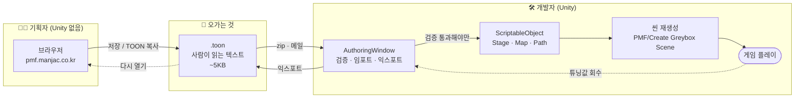
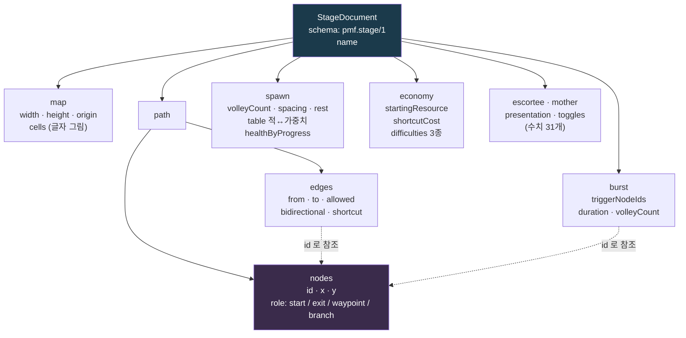
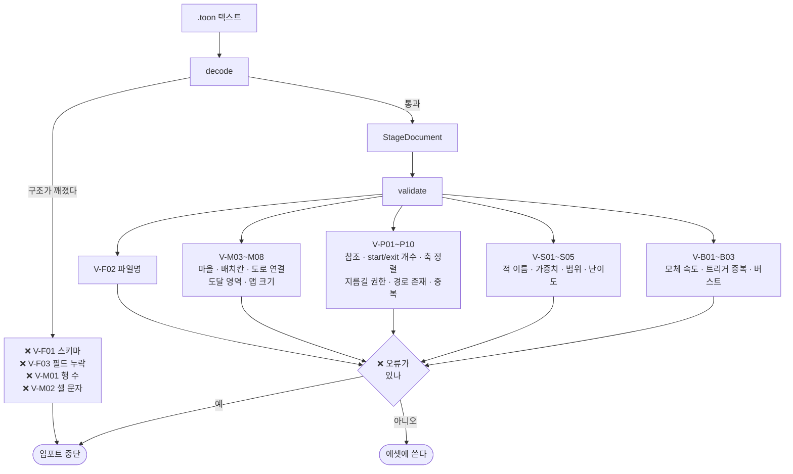
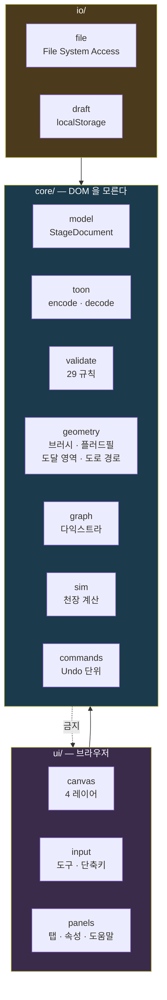
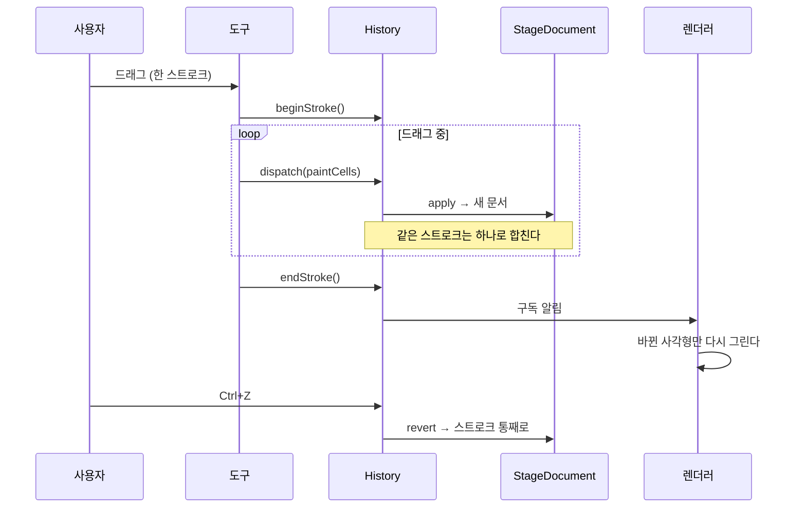
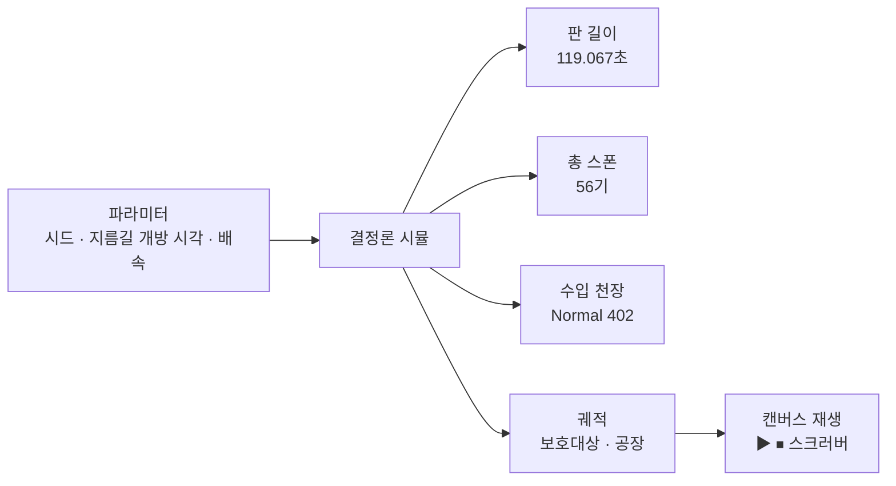

# PMF Editor

**`Prowl's Moving Factory` 의 맵·경로·스폰·밸런스를 기획자가 Unity 없이 브라우저에서 그리고 `.toon` 파일 하나로 넘기는 저작 툴.**

🔗 **https://pmf.manjac.co.kr** — 설치 없음. 링크만 열면 된다.

---

## 무엇을 해결하나

`Prowl's Moving Factory` 는 호위형 타워디펜스다. 스테이지 하나에 맵(32×18 격자), 적이 다니는 경로 그래프, 스폰 리듬, 그리고 31개의 밸런스 수치가 들어간다.

문제는 **그 전부가 Unity 안에만 있었다는 것**이다.

| | 전 | 후 |
|---|---|---|
| 맵을 고치려면 | Unity 를 열고 타일맵을 칠한다 | 브라우저에서 그린다 |
| 경로를 고치려면 | 씬에서 GameObject 를 옮긴다 | 도로를 그리면 노드가 자동으로 선다 |
| 수치를 고치려면 | `.asset` 인스펙터 | 폼에 숫자를 넣는다 |
| 실수하면 | 플레이해 봐야 안다 | **29개 규칙이 즉시 잡는다** |
| 기획자에게 넘기려면 | Unity 설치 + 프로젝트 전달 | `.toon` 파일 하나 |

---

## 전체 흐름



**핵심 규칙 셋:**

- **오가는 것은 `.toon` 하나뿐이다.** 기획자는 `.unity` · `.prefab` · `.asset` 을 보지도 받지도 않는다.
- **검증을 통과해야만 에셋에 쓴다.** 오류가 하나라도 있으면 `AssetDatabase` 를 아예 건드리지 않는다 — "전부 성공하거나 전부 취소".
- **파일이 원본이다.** 인스펙터 튜닝은 허용하되 `익스포트` 로 파일에 되돌려야 살아남는다. 다음 임포트가 덮어쓴다.

---

## `.toon` 이 뭔가

TOON(Token-Oriented Object Notation) v4.1 의 부분집합이다. **맵을 글자 그림으로 적는다.**

```toon
schema: pmf.stage/1
name: Stage_Greybox

map:
  width: 32
  height: 18
  origin[2]: -16,-9
  rows[18]{row}:
    ________________________________
    _BBBBBBBBBBBBBBBBBBBBBBBBBBBWWWW
    _BBBBBBBBBBBBBBBBBBBBBBBBBBBWWWW
    ...
  # _ 빈칸  . 땅  R 도로  B 배치가능  V 마을  W 벽  ~ 물

path:
  nodes[14]{id,x,y,role}:
    N00_start,1,9,start
    N01,5,9,waypoint
    ...
    N13_exit,30,6,exit
  edges[14]{from,to,allowed,bidirectional,shortcut}:
    N00_start,N01,All,true,false
    ...
    N05,N08,Escortee,false,true      # 지름길
```

**왜 JSON 이 아닌가:**

- 맵이 **눈으로 보인다.** 표 헤더의 `rows[18]` 이 행 수 오류를 잡는다 — 행 하나가 밀리면 맵 전체가 어긋난다.
- 주석을 쓸 수 있다. 인코더가 왜 이 값인지를 파일에 같이 적는다.
- LLM 에게 붙여넣고 밸런스를 상담할 수 있다.

---

## 화면

```
┌──────────┬────────────────────────────────────┬──────────────┐
│ 팔레트    │                                    │ 속성          │
│ 1~7      │            캔버스                   │ 미니맵        │
│          │                                    │ 레이어        │
│ 도구      │   좌클릭 칠하기 · 우클릭 메뉴         │              │
│ B L R F  │   휠 줌 · Space+드래그 팬            │              │
│ M I      │                                    │              │
│ ─────    │                                    │              │
│ 경로      │                                    │              │
│ N E V    ├────────────────────────────────────┤              │
│          │ 셀 (12,8) · 도달 B 203/381 · 히스토리 4              │
│ 경로 정리 ├────────────────────────────────────┴──────────────┤
└──────────┤ [맵] [경로] [스폰] [밸런스] [시뮬]                   │
           │  ↕ 경계를 끌어 높이 조절                             │
           └───────────────────────────────────────────────────┘
```

`?` 또는 `F1` 로 단축키 전체를 볼 수 있다. **화면에 없는 조작은 만들지 않는다** — 숨은 단축키는 아무도 못 찾는다는 것을 두 번 배웠다.

---

## 데이터 모델



**노드가 하는 일은 넷뿐이다:**

1. **경로의 뼈대** — 보호대상이 `start` → `exit` 로 걷는다. 적도 같은 그래프를 다른 권한으로 쓴다.
2. **코너를 찍는 자리** — 도로가 꺾이는 셀마다 노드가 정확히 있어야 한다. 한 칸 어긋나면 엣지가 대각선이 되어 코너를 가로지른다.
3. **버스트 트리거** — 보호대상이 그 노드를 지나면 공장이 스폰을 몰아친다. 스타크래프트 Locations 의 자리다.
4. **시작·탈출 표시** — `start` 셀에서 **보호대상과 공장이 함께** 출발한다.

> 트리거 스크립팅은 **비목표**다. 노드로 짜는 "시나리오" 는 "어느 지점에서 압박이 세지는가" 하나다.

---

## 검증 — 29개 규칙

저장은 언제나 된다. **거부하는 것은 임포터뿐이다.** 잘못된 데이터보다 작업 손실이 크다.



**decode 소관은 정확히 넷이다.** 구조가 깨진 문서는 `StageDocument` 를 만들 수조차 없으므로 검증기가 볼 대상이 없다. 여기에 규칙을 더 넣으면 **그 규칙은 영영 실행되지 않는데 테스트는 초록불이 된다** — 실제로 그렇게 규칙 6개가 미실행이었다. 감사 테스트가 그 경계를 지킨다.

TS(툴)와 C#(임포터)이 **같은 규칙 ID·같은 메시지**를 낸다. 픽스처 29개를 두 저장소가 공유하고, `npm run sync:fixtures` 로만 갱신한다.

---

## 아키텍처



**`core/` 는 DOM 을 모른다.** 그래서 코덱·검증·시뮬을 전부 vitest 로 덮을 수 있고, C# 임포터와 1:1로 대조할 수 있다. 게이트 테스트가 이 규칙을 강제한다.

### 편집은 커맨드로만



문서는 **커맨드로만** 바뀐다. 제자리 수정 금지. 그래서 Undo 가 스타크래프트 맵 에디터처럼 동작한다.

---

## 시뮬레이션 — 천장만 잰다



**전투도 승패도 계산하지 않는다.** 움직이는 것은 보호대상과 공장 둘뿐이고, 적은 스폰 *개수*만 센다.

> 자동 시뮬로 승패를 판정하려다 세 번 틀렸다. 툴은 **천장** 만 잰다.

이 세 숫자(119.067 / 56 / 402)는 회귀 기준이다. 수식을 건드리면 테스트가 즉시 잡는다.

---

## 개발

```bash
npm install
npm run dev          # 개발 서버 (HMR)
npm test             # vitest — 403개
npm run typecheck    # tsc --noEmit
npm run build        # dist/pmf-editor.html 파일 하나
npm run deploy       # VPS 로 scp + URL 헤더 확인
npm run sync:fixtures  # 픽스처를 게임 저장소로 복사
```

- **TypeScript strict, 런타임 의존성 0.** 라이브러리를 넣으려면 먼저 물어라.
- 산출물은 **HTML 파일 하나** (~132KB). 더블클릭으로도 열린다.

### 게이트 — 문화가 아니라 테스트다

| 게이트 | 무엇을 막나 |
|---|---|
| `header-gate` | 모든 파일에 **목적 / 왜 이 구조인가 / 바꾸면 안 되는 것 / 근거** 4항목 헤더 |
| `core-purity` | `core/` 안의 DOM·`../ui` 참조 |
| `palette-source` | 색 값 옆에 게임 코드 출처 주석 (`// 출처: SceneParts.cs:41`) |
| `schema-version` | `SCHEMA` 상수와 씨앗·픽스처의 `schema:` 일치 |
| `fixtures-sync` | 두 저장소의 픽스처가 어긋남 |
| `rules-fixtures` | 규칙 하나당 픽스처 하나, **정확히 그 ID 만** 낸다 |
| `commands-coverage` | 새 커맨드에 Undo 왕복 테스트 누락 |

`// 왜:` 는 비자명한 판단, `// 출처:` 는 게임에서 옮긴 값, `// 편차:` 는 의도적 사양 위반에 붙인다.

---

## 진척

```mermaid
gantt
    title 마일스톤
    dateFormat X
    axisFormat %s
    section 완료
    M0 골격                :done, 0, 1
    M1 코어 (코덱·검증·기하)  :done, 1, 2
    M2 맵 편집 UI + 배포     :done, 2, 3
    M3 경로·스폰·밸런스      :done, 3, 4
    M4 시뮬레이션           :done, 4, 5
    section 진행
    M5 Unity 임포터·익스포터 :active, 5, 6
    section 남음
    M6 기획자 왕복          :6, 7
```



| | 상태 |
|---|---|
| M0~M4 | ✅ 403 tests · 배포됨 |
| M5 (1) 익스포터 + SO | ✅ 씨앗과 바이트 동일 |
| M5 (2) Reader · Validator · 픽스처 | ✅ EditMode 120 |
| M5 (3) Importer + 창 | ✅ |
| M5 (4) SceneParts 연결 | ✅ 셀·도달 영역 기계 검증 통과 |
| M5 (5) 플레이 확인 | ☐ 사람 |
| M5 (6) 총수입 재측정 | ☐ |
| M6 기획자 왕복 | ☐ |

**열려 있는 문제 2건:** 익스포터가 SO 대신 C# 상수를 읽는다 · 씬 재생성 시 노드 수가 SO 와 다르다. 둘 다 `docs/SDD-05` §8 과 대조 중.

---

## 결정 기록

돌이키기 어려운 판단은 전부 ADR 한 장으로 남긴다. **뒤집으려면 그 문서부터 읽어라.**

| ADR | 결정 | 왜 |
|---|---|---|
| [E01](docs/adr/ADR-E01-single-html.md) | 단일 HTML · VPS 정적 호스팅 | 기획자 설치 0, 서버 부담 0 |
| [E02](docs/adr/ADR-E02-toon-format.md) | TOON 저장 포맷 · 인코더가 주석을 냄 | 맵이 눈에 보이고 LLM 상담이 된다 |
| [E03](docs/adr/ADR-E03-core-ui-io.md) | `core/` 는 DOM 을 모른다 | 테스트로 전부 덮고 C# 과 1:1 |
| [E04](docs/adr/ADR-E04-command-undo.md) | 문서는 커맨드로만 · 스트로크당 하나 | 스타크래프트급 Undo 의 유일한 길 |
| [E05](docs/adr/ADR-E05-village-is-cell.md) | 마을은 셀, 시작·탈출은 노드 role | 같은 사실을 두 곳에 두지 않는다 |
| [E06](docs/adr/ADR-E06-node-id-stable.md) | 노드 id 불변, 툴이 재번호 안 함 | 게임이 이름으로 정확 일치 매칭 |
| [E07](docs/adr/ADR-E07-sim-ceiling-only.md) | 시뮬은 천장만 | 승패 판정으로 세 번 틀렸다 |
| [E08](docs/adr/ADR-E08-save-despite-errors.md) | 검증 실패해도 저장 허용 | 작업 손실 > 잘못된 데이터 |
| [E09](docs/adr/ADR-E09-palette-source.md) | 색·수식은 게임 코드에서 복사 | 원본이 둘이면 최신을 모른다 |
| [E10](docs/adr/ADR-E10.md) | C# ToonWriter · Exporter 포팅 | 바이트 동일이 두 구현의 증거 |
| [E11](docs/adr/ADR-E11-shortcut-one-way.md) | 지름길 엣지는 단방향 | 보호대상은 앞으로만 간다 |
| [E12](docs/adr/ADR-E12-right-click-is-menu.md) | 우클릭 = 컨텍스트 메뉴 | 지우기는 덧칠과 같은 일이었다 |

---

## 문서

| 파일 | 내용 |
|---|---|
| [SDD-00](docs/SDD-00-개요.md) | 목표·비목표 · 스타크래프트 대응표 · **주석 규약** |
| [SDD-01](docs/SDD-01-아키텍처.md) | 계층 · 커맨드/Undo · 렌더 · 팔레트 출처 · 호스팅 |
| [SDD-02](docs/SDD-02-데이터모델.md) | **계약.** `StageDocument` · TOON 스키마 · SO 31필드 · 검증 규칙표 |
| [SDD-03](docs/SDD-03-편집UX.md) | 화면 · 도구 · 레이어 · 단축키 · 컨텍스트 메뉴 |
| [SDD-04](docs/SDD-04-시뮬레이션.md) | 무엇을 계산하고 무엇을 안 하는가 · 게임 수식 |
| [SDD-05](docs/SDD-05-Unity임포터.md) | 게임 쪽 파서·검증·임포터·익스포터·씬 빌더 |
| [SDD-06](docs/SDD-06-검증과-테스트.md) | 골든 · 픽스처 · 게이트 · 수용 조건 |
| [SDD-07](docs/SDD-07-로드맵.md) | M0~M6 |
| [SDD-08](docs/SDD-08-확정API.md) | **구현 계약.** 시그니처 · 파일 배치 · 금지 목록 |
| [SDD-09](docs/SDD-09-알고리즘.md) | 함수 본문 명세 — 순서·동률 규칙은 결정론 때문이다 |

**게임 코드가 진실이고 이 툴은 사본이다.** 색·수식·enum 값은 게임에서 복사하고 출처를 주석으로 남긴다.
